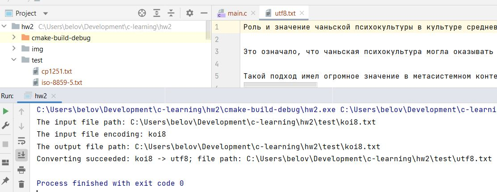
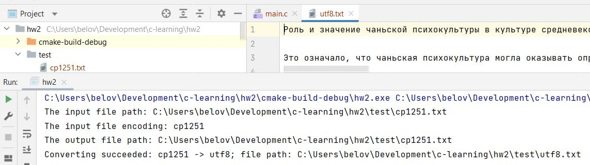
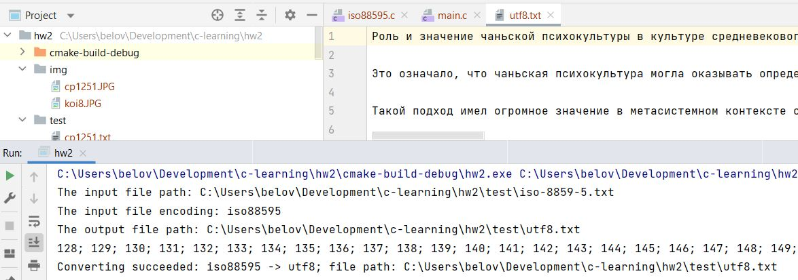

# Домашняя работа №2

### Задание:

1. Написать конвертор из заданной кодировки (cp-1251, koi8, iso-8859-5) в utf-8.
2. Сторонние библиотеки не использовать. Требования:
3. Создано консольное приложение, принимающее аргументами командной строки входной файл, заданную кодировку и выходной файл.
4. Конвертация из каждой из трёх указанных кодировок корректно отрабатывает (файлы для проверки прилагаются).
5. Приложение корректно обрабатывает ошибки доступа к файлам.
6. Код компилируется без warning'ов с ключами компилятора -Wall -Wextra -Wpedantic -std=c11.

### Результат

##### KOI8

##### CP1251

##### ISO8859
