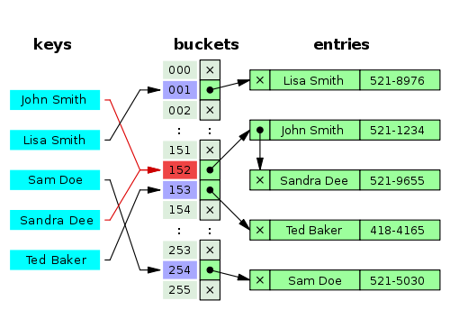

# Домашняя работа №3

### Задание:

1. Написать реализацию хэш-таблицы с открытой адресацией со строками в качестве ключей и целыми числами в качестве значений.
2. На основе полученной реализации написать программу, подсчитывающую частоту слов в заданном файле.
3. Сторонние библиотеки не использовать. 

###### Требования:
1. Создано консольное приложение, принимающее аргументом командной строки входной файл.
2. Приложение корректно обрабатывает ошибки доступа к файлу.
3. Приложение корректно подсчитывает и выводит на экран информацию о том, сколько раз в файле встречается каждое слово, которое есть в файле.
4. Код компилируется без warning'ов с ключами компилятора -Wall -Wextra -Wpedantic -std=c11.
5. Далее успешность определяется code review.

### Реализация



Есть массив корзин. По хеш-функции определяется номер корзины. Если возникает коллизия ключей, создается ссылка на новую ячейку, куда записываются новые данные. Если коллизии нет, в ячейку записывается новое значение.

#### Файл
````
aaa bbb aaa ccc ddd eee jjj ooo www aaa mmm ddd ccc vvv eee eee aaa vvv
````

#### Результат
````
[ddd => 2]
[eee => 3]
[mmm => 1]
[aaa => 4]
[ooo => 1]
[bbb => 1]
[vvv => 2]
[ccc => 2]
[www => 1]
[jjj => 1]
````

#### Полный лог с технической информацией

По логу видно, что хеш-мапа корректно обрабатывает коллизии ключей (пример слов __"bbb"__ и __"vvv"__, получающие один и тот же хеш-код).

````
C:\Users\belov\Development\c-learning\hw3\cmake-build-debug\hw3.exe C:\Users\belov\Development\c-learning\hw3\text.txt
Path to the input file: C:\Users\belov\Development\c-learning\hw3\text.txt
word = aaa; count = 0
for key = aaa hash = 11
entry #0; key = aaa; entry->key = (null); entry->value = 0
fill entry: entry->key: aaa ; entry->value = 1
Bucket11 :: [aaa => 1]
NextEntry = 0x0
-----------
[aaa => 1; address => 0x800058a40]
===========
word = bbb; count = 0
for key = bbb hash = 14
entry #0; key = bbb; entry->key = (null); entry->value = 0
fill entry: entry->key: bbb ; entry->value = 1
Bucket14 :: [bbb => 1]
NextEntry = 0x0
-----------
[aaa => 1; address => 0x800058a40]
[bbb => 1; address => 0x800058aa0]
===========
word = aaa; count = 1
for key = aaa hash = 11
entry #0; key = aaa; entry->key = aaa; entry->value = 1
adding to existing; new value = 2
Bucket11 :: [aaa => 2]
NextEntry = 0x0
-----------
[aaa => 2; address => 0x800058a40]
[bbb => 1; address => 0x800058aa0]
===========
word = ccc; count = 0
for key = ccc hash = 17
entry #0; key = ccc; entry->key = (null); entry->value = 0
fill entry: entry->key: ccc ; entry->value = 1
Bucket17 :: [ccc => 1]
NextEntry = 0x0
-----------
[aaa => 2; address => 0x800058a40]
[bbb => 1; address => 0x800058aa0]
[ccc => 1; address => 0x800058b00]
===========
word = ddd; count = 0
for key = ddd hash = 0
entry #0; key = ddd; entry->key = (null); entry->value = 0
fill entry: entry->key: ddd ; entry->value = 1
Bucket0 :: [ddd => 1]
NextEntry = 0x0
-----------
[ddd => 1; address => 0x8000588e0]
[aaa => 2; address => 0x800058a40]
[bbb => 1; address => 0x800058aa0]
[ccc => 1; address => 0x800058b00]
===========
word = eee; count = 0
for key = eee hash = 3
entry #0; key = eee; entry->key = (null); entry->value = 0
fill entry: entry->key: eee ; entry->value = 1
Bucket3 :: [eee => 1]
NextEntry = 0x0
-----------
[ddd => 1; address => 0x8000588e0]
[eee => 1; address => 0x800058940]
[aaa => 2; address => 0x800058a40]
[bbb => 1; address => 0x800058aa0]
[ccc => 1; address => 0x800058b00]
===========
word = jjj; count = 0
for key = jjj hash = 18
entry #0; key = jjj; entry->key = (null); entry->value = 0
fill entry: entry->key: jjj ; entry->value = 1
Bucket18 :: [jjj => 1]
NextEntry = 0x0
-----------
[ddd => 1; address => 0x8000588e0]
[eee => 1; address => 0x800058940]
[aaa => 2; address => 0x800058a40]
[bbb => 1; address => 0x800058aa0]
[ccc => 1; address => 0x800058b00]
[jjj => 1; address => 0x800058b20]
===========
word = ooo; count = 0
for key = ooo hash = 13
entry #0; key = ooo; entry->key = (null); entry->value = 0
fill entry: entry->key: ooo ; entry->value = 1
Bucket13 :: [ooo => 1]
NextEntry = 0x0
-----------
[ddd => 1; address => 0x8000588e0]
[eee => 1; address => 0x800058940]
[aaa => 2; address => 0x800058a40]
[ooo => 1; address => 0x800058a80]
[bbb => 1; address => 0x800058aa0]
[ccc => 1; address => 0x800058b00]
[jjj => 1; address => 0x800058b20]
===========
word = www; count = 0
for key = www hash = 17
entry #0; key = www; entry->key = ccc; entry->value = 1
create entry: 0x800058b00
entry #1; key = www; entry->key = (null); entry->value = 0
fill entry: entry->key: www ; entry->value = 1
Bucket17 :: [ccc => 1]
NextEntry = 0x800068c90
Bucket17 :: [www => 1]
NextEntry = 0x0
-----------
[ddd => 1; address => 0x8000588e0]
[eee => 1; address => 0x800058940]
[aaa => 2; address => 0x800058a40]
[ooo => 1; address => 0x800058a80]
[bbb => 1; address => 0x800058aa0]
[ccc => 1; address => 0x800058b00]
[www => 1; address => 0x800068c90]
[jjj => 1; address => 0x800058b20]
===========
word = aaa; count = 2
for key = aaa hash = 11
entry #0; key = aaa; entry->key = aaa; entry->value = 2
adding to existing; new value = 3
Bucket11 :: [aaa => 3]
NextEntry = 0x0
-----------
[ddd => 1; address => 0x8000588e0]
[eee => 1; address => 0x800058940]
[aaa => 3; address => 0x800058a40]
[ooo => 1; address => 0x800058a80]
[bbb => 1; address => 0x800058aa0]
[ccc => 1; address => 0x800058b00]
[www => 1; address => 0x800068c90]
[jjj => 1; address => 0x800058b20]
===========
word = mmm; count = 0
for key = mmm hash = 7
entry #0; key = mmm; entry->key = (null); entry->value = 0
fill entry: entry->key: mmm ; entry->value = 1
Bucket7 :: [mmm => 1]
NextEntry = 0x0
-----------
[ddd => 1; address => 0x8000588e0]
[eee => 1; address => 0x800058940]
[mmm => 1; address => 0x8000589c0]
[aaa => 3; address => 0x800058a40]
[ooo => 1; address => 0x800058a80]
[bbb => 1; address => 0x800058aa0]
[ccc => 1; address => 0x800058b00]
[www => 1; address => 0x800068c90]
[jjj => 1; address => 0x800058b20]
===========
word = ddd; count = 1
for key = ddd hash = 0
entry #0; key = ddd; entry->key = ddd; entry->value = 1
adding to existing; new value = 2
Bucket0 :: [ddd => 2]
NextEntry = 0x0
-----------
[ddd => 2; address => 0x8000588e0]
[eee => 1; address => 0x800058940]
[mmm => 1; address => 0x8000589c0]
[aaa => 3; address => 0x800058a40]
[ooo => 1; address => 0x800058a80]
[bbb => 1; address => 0x800058aa0]
[ccc => 1; address => 0x800058b00]
[www => 1; address => 0x800068c90]
[jjj => 1; address => 0x800058b20]
===========
word = ccc; count = 1
for key = ccc hash = 17
entry #0; key = ccc; entry->key = ccc; entry->value = 1
adding to existing; new value = 2
Bucket17 :: [ccc => 2]
NextEntry = 0x800068c90
Bucket17 :: [www => 1]
NextEntry = 0x0
-----------
[ddd => 2; address => 0x8000588e0]
[eee => 1; address => 0x800058940]
[mmm => 1; address => 0x8000589c0]
[aaa => 3; address => 0x800058a40]
[ooo => 1; address => 0x800058a80]
[bbb => 1; address => 0x800058aa0]
[ccc => 2; address => 0x800058b00]
[www => 1; address => 0x800068c90]
[jjj => 1; address => 0x800058b20]
===========
word = vvv; count = 0
for key = vvv hash = 14
entry #0; key = vvv; entry->key = bbb; entry->value = 1
create entry: 0x800058aa0
entry #1; key = vvv; entry->key = (null); entry->value = 0
fill entry: entry->key: vvv ; entry->value = 1
Bucket14 :: [bbb => 1]
NextEntry = 0x800068d50
Bucket14 :: [vvv => 1]
NextEntry = 0x0
-----------
[ddd => 2; address => 0x8000588e0]
[eee => 1; address => 0x800058940]
[mmm => 1; address => 0x8000589c0]
[aaa => 3; address => 0x800058a40]
[ooo => 1; address => 0x800058a80]
[bbb => 1; address => 0x800058aa0]
[vvv => 1; address => 0x800068d50]
[ccc => 2; address => 0x800058b00]
[www => 1; address => 0x800068c90]
[jjj => 1; address => 0x800058b20]
===========
word = eee; count = 1
for key = eee hash = 3
entry #0; key = eee; entry->key = eee; entry->value = 1
adding to existing; new value = 2
Bucket3 :: [eee => 2]
NextEntry = 0x0
-----------
[ddd => 2; address => 0x8000588e0]
[eee => 2; address => 0x800058940]
[mmm => 1; address => 0x8000589c0]
[aaa => 3; address => 0x800058a40]
[ooo => 1; address => 0x800058a80]
[bbb => 1; address => 0x800058aa0]
[vvv => 1; address => 0x800068d50]
[ccc => 2; address => 0x800058b00]
[www => 1; address => 0x800068c90]
[jjj => 1; address => 0x800058b20]
===========
word = eee; count = 2
for key = eee hash = 3
entry #0; key = eee; entry->key = eee; entry->value = 2
adding to existing; new value = 3
Bucket3 :: [eee => 3]
NextEntry = 0x0
-----------
[ddd => 2; address => 0x8000588e0]
[eee => 3; address => 0x800058940]
[mmm => 1; address => 0x8000589c0]
[aaa => 3; address => 0x800058a40]
[ooo => 1; address => 0x800058a80]
[bbb => 1; address => 0x800058aa0]
[vvv => 1; address => 0x800068d50]
[ccc => 2; address => 0x800058b00]
[www => 1; address => 0x800068c90]
[jjj => 1; address => 0x800058b20]
===========
word = aaa; count = 3
for key = aaa hash = 11
entry #0; key = aaa; entry->key = aaa; entry->value = 3
adding to existing; new value = 4
Bucket11 :: [aaa => 4]
NextEntry = 0x0
-----------
[ddd => 2; address => 0x8000588e0]
[eee => 3; address => 0x800058940]
[mmm => 1; address => 0x8000589c0]
[aaa => 4; address => 0x800058a40]
[ooo => 1; address => 0x800058a80]
[bbb => 1; address => 0x800058aa0]
[vvv => 1; address => 0x800068d50]
[ccc => 2; address => 0x800058b00]
[www => 1; address => 0x800068c90]
[jjj => 1; address => 0x800058b20]
===========
word = vvv; count = 1
for key = vvv hash = 14
entry #0; key = vvv; entry->key = bbb; entry->value = 1
entry #1; key = vvv; entry->key = vvv; entry->value = 1
adding to existing; new value = 2
Bucket14 :: [bbb => 1]
NextEntry = 0x800068d50
Bucket14 :: [vvv => 2]
NextEntry = 0x0
-----------
[ddd => 2; address => 0x8000588e0]
[eee => 3; address => 0x800058940]
[mmm => 1; address => 0x8000589c0]
[aaa => 4; address => 0x800058a40]
[ooo => 1; address => 0x800058a80]
[bbb => 1; address => 0x800058aa0]
[vvv => 2; address => 0x800068d50]
[ccc => 2; address => 0x800058b00]
[www => 1; address => 0x800068c90]
[jjj => 1; address => 0x800058b20]
===========

Process finished with exit code 0
````